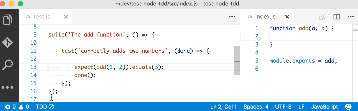

# node-tdd

> A [Visual Studio Code](http://code.visualstudio.com/) [extension](https://marketplace.visualstudio.com/items?itemName=prashaantt.node-tdd) to ease [test-driven development](https://en.wikipedia.org/wiki/Test-driven_development) in Node/JavaScript.

## Features

- Activates when a workspace containing `package.json` is opened.
- Triggers an automatic test build whenever source files are updated.
- Shows a colour-coded build summary.
- Shows the average test coverage (experimental).
- Optionally, if your test runner generates [TAP output](https://testanything.org/producers.html#javascript), use the `nodeTdd.reporter` [setting](#settings) to provide a more meaningful test summary:

- Finally, use `nodeTdd.minimal` to reclaim some status bar real estate:

## Settings

This extension contributes the following settings:

| Setting                     | Type           | Default                           | Description                                                         |
| --------------------------- | -------------- | --------------------------------- | ------------------------------------------------------------------- |
| `nodeTdd.activateOnStartup` | boolean        | `true`                            | Activate TDD mode when workspace is opened                          |
| `nodeTdd.testScript`        | string         | `test`                            | The npm script to run tests                                         |
| `nodeTdd.glob`              | string         | `{src,test}/**/*.{js,ts,jsx,tsx}` | The glob pattern for files to watch, relative to the workspace root |
| `nodeTdd.verbose`           | boolean        | `false`                           | Show build status dialogs                                           |
| `nodeTdd.minimal`           | boolean        | `false`                           | Minimise status bar clutter                                         |
| `nodeTdd.buildOnActivation` | boolean        | `false`                           | Run tests when TDD mode is activated                                |
| `nodeTdd.buildOnCreate`     | boolean        | `false`                           | Run tests when matching files are created                           |
| `nodeTdd.buildOnDelete`     | boolean        | `false`                           | Run tests when matching files are deleted                           |
| `nodeTdd.showCoverage`      | boolean        | `false`                           | Show the average test coverage if reported (experimental)           |
| `nodeTdd.coverageThreshold` | number / null  | `null`                            | The coverage threshold percentage, used to colour-code the coverage |
| `nodeTdd.reporter`          | string / null  | `null`                            | The test reporter used (currently only "tap" is supported)          |

## Commands

The following commands are available from the commands menu as well as status bar buttons:

| Command        | Action                                |
| -------------- | ------------------------------------- |
| `activate`     | Activate `node-tdd` in a workspace    |
| `deactivate`   | Deactivate `node-tdd` in a workspace |
| `toggleOutput` | Toggle detailed test results output   |
| `stopBuild`    | Stop a running build                  |

## Limitations and known issues

- The extension doesn't get activated if `package.json` was not initially present when the workspace was opened; a window restart will be required to detect a change.
- It doesn't work with watch mode/incremental test builds. The build process used for running tests must exit on each execution, otherwise it will never report the status.
- `showCoverage` is an experimental setting that currently only works with the text-summary reports from [Lab](https://github.com/hapijs/lab), [Istanbul](https://github.com/gotwarlost/istanbul) and [nyc](https://github.com/istanbuljs/nyc). Disable it if it doesn't work for you or its output looks funny.
- Ironically for a TDD extension, it has very few tests of its own because I don't yet know how to test UI elements in VS Code. :/

Suggestions and PRs are [welcome](https://github.com/prashaantt/node-tdd/issues).

## Release notes

See the [change log](CHANGELOG.md). If you are reading this from within VS Code, click on the Changelog tab of the extension preview page.

## License

MIT License.
